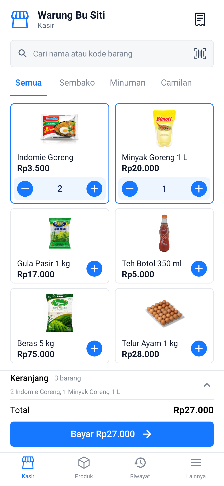

# Cashier UI reference implementation

This revision focuses on the three images supplied by the owner: the phone catalog, cart bottom sheet, and payment page. It supersedes the approximate cashier layout from PR #1.

## Changes

- White canvas, bright blue accent, thin outline icons, underlined category tabs, and compact two-column product cards.
- Product photographs read the existing `ProductEntity.imageUrl`. The product form now supports choosing/removing a photograph through Android's document picker, and editing a product preserves its image URI. Missing/unavailable photographs show an outlined product placeholder.
- Selected cards have a pale blue quantity bar; unselected cards have a circular add button. The sticky cart header opens the cart, and **Bayar [total]** opens checkout directly.
- Four phone navigation destinations: **Kasir, Produk, Riwayat, Lainnya**. Lainnya exposes reports, inventory, expenses, customers, and settings.
- Cart sheet includes customer selection, product thumbnails, quantities, line totals, deletion, add products, discounts, subtotal, and a fixed **Tahan / Bayar [total]** footer. Clear-cart confirmation remains in place.
- Payment uses three method tiles, a large cash amount, exact/50,000/100,000 presets, a live change/shortfall strip, and a dedicated numeric keypad. Insufficient cash disables payment; processing disables the main payment controls.
- **Lihat rincian** expands line items and additional options, including order notes, cafe/table controls, debit and split payments. Existing payment recording and tax/service calculations are retained.

## Validation

- `:app:assembleDebug` succeeded.
- All **41 unit and Compose UI tests** passed on Robolectric API 34, including cart actions, navigation access, cash keypad/presets, insufficient cash, non-cash payment totals, and processing controls.
- Catalog, cart and payment were rendered at 393 × 852 dp and visually inspected. Tests check that the final catalog price and bottom keypad row remain visible at this size.
- `git diff --check` passed.

These are native Android simulator renders. Android system bars, font rendering, and product photographs differ from the iOS-style reference artwork. Product photographs in the screenshots are test fixtures; their provenance is recorded in `app/src/test/resources/products/README.md`. Production products use their own selected images, and example products/prices are not added to the database.

Physical-device, tablet, large-font and dark-mode visual checks remain outside this simulator verification. Shorter screens retain scrolling with a fixed payment action. Persisted photo URIs depend on the selected document remaining available on the device.

| Catalog | Cart sheet | Payment |
| --- | --- | --- |
|  |  |  |

The earlier changes to reports, history, settings and other screens remain from PR #1; this revision does not claim to match additional mockups.
