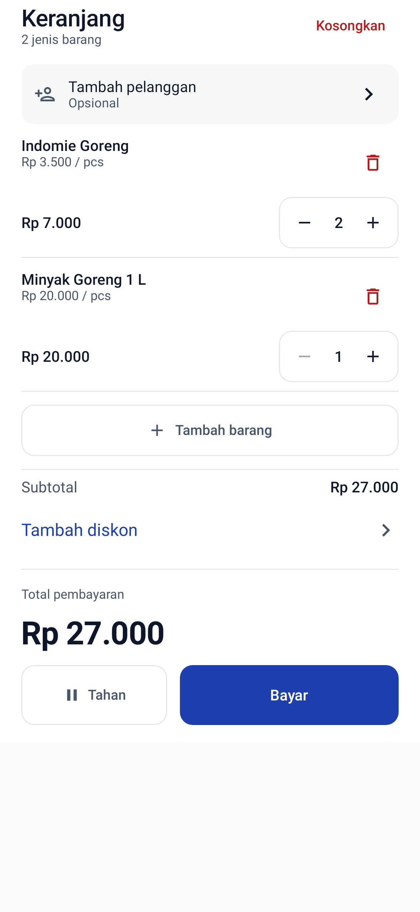
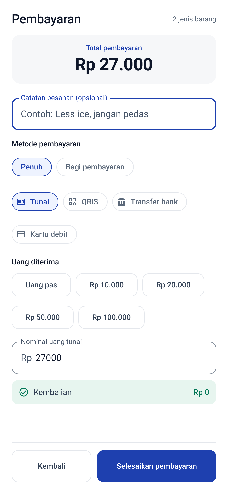

# Mobile UI redesign

This implementation follows the available mockup descriptions and the blue/neutral palette in `DESIGN.md`. The original mockup images were not available in this checkout, so exact visual matching remains a review step.

## Interaction changes

- The mobile catalog opens **Lihat keranjang**, then payment. Category chips and 48dp quantity controls share the same visual language.
- The cart wraps short orders, scrolls its contents when needed, and keeps totals and **Tahan / Bayar** visible. Removing a line has its own button; clearing the whole order requires confirmation. **Tambah barang** returns to the catalog.
- Checkout and the success receipt are full pages on phones and constrained panels on tablets. Receipt sharing and printing are secondary actions; **Transaksi baru** is primary.
- Quick cash amounts replace the amount received, with **Uang pas** for exact payment. Insufficient cash disables completion.
- Product creation has a persistent save button, stable add/edit titles, required name and selling price, and expandable SKU/barcode/variant settings. Product search now includes SKU as its placeholder promises.
- History has today/7-day/all-date filters backed by a date-range query, without the former 100-row cap. Revenue in the filtered summary includes completed transactions only. Held orders are now reachable through the status filter.
- Reports add a real-data sales chart, payment totals, and CSV export through the Android document picker. The chart shows dates with completed sales; all-time reports group by month. Existing split-payment records are attributed to their recorded primary method, as indicated in the UI.
- Bottom navigation uses native selection semantics and the app palette. Settings use consistent Indonesian labels and theme colors.

## Review on a device

Check a small portrait phone, large text, dark mode, landscape and tablet. Walk through product selection, variants, cart quantities, discounts, hold/resume, cash/non-cash checkout, printer errors, sharing, form validation, history filters, and report export.

Product images still use the existing category placeholders; a photo management feature is outside these layout changes. Business calculations, payment recording, printer integration, and database schema are retained.

## Validation completed

- Debug APK assembled successfully (`:app:assembleDebug`).
- 33 existing/new non-UI tests passed, including the date-range query regression covering more than 100 transactions.
- Both Compose UI tests passed on Robolectric API 34: cart clear confirmation / return to catalog, and insufficient cash / quick nominal selection.
- Rendered cart and checkout screens were visually inspected. These are simulator renders, not photos of a physical device.
- `git diff --check` passed.

The environment required a temporary Java 17 JDK, Android SDK 36, and an offline Robolectric Android 14 runtime. Those machine-specific paths are not part of the project configuration.

| Cart content | Payment page |
| --- | --- |
|  |  |
